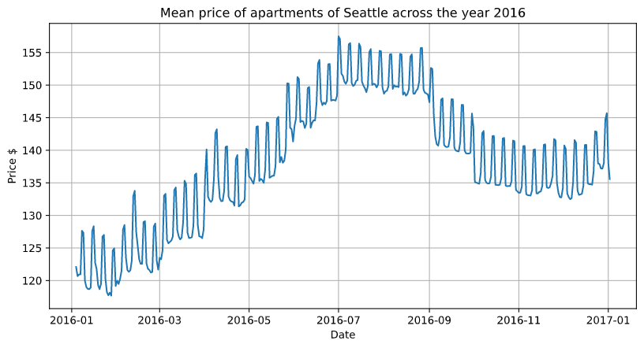
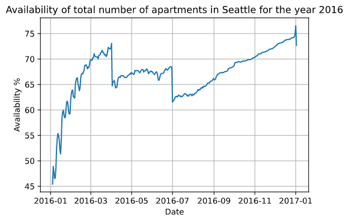

# Data Scientist Nanodegree - Project Part 1

## Motivation

The aim of this project is to apply the CRISP-DM process for data analysis to the Kaggle Airbnb Seattle Dataset within the Part 1 Project of the Udacity Data Scientist Nanodegree.

You can find the dataset in the repository (data"\") or in the following Kaggle link:

The CRISP-DM process consists of the following parts, which are replicated in the attached notebook:

1. Business Understanding 
2. Data Understanding
3. Data Preparation 
4. Modeling
5. Evaluation
6. Deployment

For the first point, I'm answering the following questions:

- How does the availability varies during the year in Seattle?
- Which are the neighbourhoods (zip codes) with better price/review ratio?
- Can we predict the prices of the apartments?

## Used Packages

- Python        3.7.0
- Pandas        1.0.3
- Numpy         1.15.1
- Matplotlib    3.2.1
- Sklearn       0.24.1

## Key Insights and results

**The complete analysis can be found in the Notebook**

| Neighbourhood | Zipcode | Ration |
| --- | --- | ---|
| Unknown | Title | xxxx |
| Unknown | Title | xxxx |
| Unknown | Title | xxxx |
| Unknown | Title | xxxx |
| Unknown | Title | xxxx |
| Unknown | Title | xxxx |
| Unknown | Title | xxxx |
| Unknown | Title | xxxx |
| Unknown | Title | xxxx |
| Unknown | Title | xxxx |

